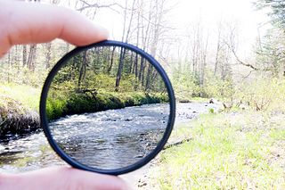

# Your basic Bloom filter

Golang Bloom filter implementation

*Image by [Robert Emperley][re], [CC BY-SA 2.0][ccbysa].*

### Installation

Once you have [installed Go][golang-install], run this command
to install the `bloom` package:

    go get github.com/yourbasic/bloom
    
### Documentation

There is an online reference for the package at
[godoc.org/github.com/yourbasic/bloom][godoc-bloom].

### Roadmap

* The API of this library is frozen.
* Version numbers adhere to [semantic versioning][sv].

The only accepted reason to modify the API of this package is to handle
bug fixes that can't be resolved in any other reasonable way.

### Thanks

Thanks to [Sébastien Paolacci][sp] for his excellent MurmurHash implementation.

Stefan Nilsson – [korthaj](https://github.com/korthaj)

[godoc-bloom]: https://godoc.org/github.com/yourbasic/bloom
[golang-install]: http://golang.org/doc/install.html
[ccbysa]: https://creativecommons.org/licenses/by-sa/2.0/deed.en
[re]: https://www.flickr.com/photos/66016280@N00
[sp]: https://github.com/spaolacci
[sv]: http://semver.org/
